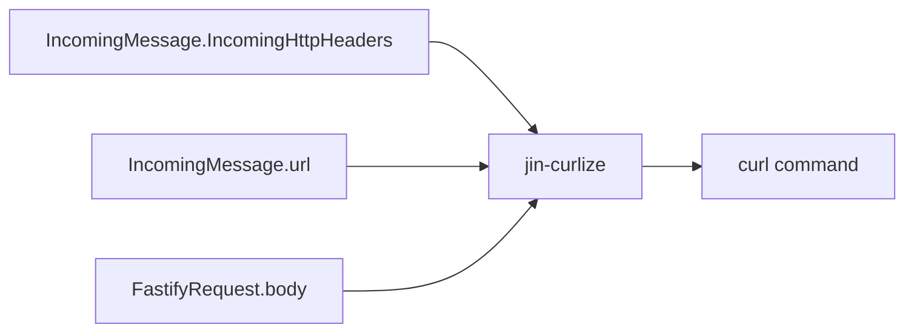

# jin-curlize


[](https://npmcharts.com/compare/jin-curlize?minimal=true)
[](https://github.com/imjuni/jin-curlize)
[](https://github.com/imjuni/jin-curlize/issues)
[](https://www.npmjs.com/package/jin-curlize)
[](https://github.com/imjuni/jin-curlize/blob/master/LICENSE)
[](https://github.com/imjuni/jin-curlize/actions/workflows/ci.yml)
[](https://codecov.io/gh/imjuni/jin-curlize)
[](https://github.com/prettier/prettier)

jin-curlize create curl command from FastifyRequest.

Why?

1. automatic create curl command from FastifyRequest
1. Quickly retry error request
1. Support querystring, header, body replacer

## Table of Contents <!-- omit in toc -->

- [How to works?](#how-to-works)
- [Usage](#usage)
- [Example](#example)
- [Options](#options)
- [How do I add transaction id on querystring?](#how-do-i-add-transaction-id-on-querystring)
- [r2curl](#r2curl)

## How to works?

`jin-curlize` create curl command from `FastifyRequest`. URL, querystirng, header create using `IncomingMessage` in `FastifyRequest`. For example,

- `IncomingMessage`.`IncomingHttpHeaders` to `--header` option
- `IncomingMessage`.url to querystring and href

But `IncomingMessage` is already ended ReadableStream in `FastifyReqest`. So body create using `FastifyRequest`.body.



## Usage

```ts
import fastify from 'fastify';
import { createV3 } from 'jin-curlize';

const fastify = require('fastify')({
  logger: {
    transport: {
      target: 'pino-pretty'
    },
    serializers: {
      res (reply) {
        return {
          statusCode: reply.statusCode
        }
      },
      req (request) {
        return {
          method: request.method,
          url: request.url,
          path: request.routerPath,
          parameters: request.params,
          headers: request.headers
          curl: createV3(request)
        };
      }
    }
  }
});

server.listen({ host: '0.0.0.0', port: 3000 });
```

## Example

Axios Request

```js
await axios.request({
  method: 'post',
  url: `http://localhost:3000/post-form`,
  headers: { 'Content-Type': 'application/x-www-form-urlencoded' },
  data: querystring.stringify({
    name: 'ironman',
    ability: ['energy repulsor', 'supersonic flight'],
  }),
});
```

Create command

```bash
curl -X POST 'http://localhost:3000/post-form' --header 'content-type: application/x-www-form-urlencoded' --data name='ironman' --data ability='energy repulsor' --data ability='supersonic flight'
```

## Options

| Name | Requirement | Description |
|-|-|-|
| prettify | require | Apply prettifing. Add newline and backslash add on line-ending |
| indent | optional | Only work on prettify set true, make space size |
| disableFollowRedirect| optional | If set true, remove `--location` option from command |
| replacer.querystring | optional | replacer for querystring |
| replacer.body | optional | replacer for body |
| replacer.header | optional | replacer for header |

## How do I add transaction id on querystring?

```ts
import { createV3, encodeQuerystring } from 'jin-curlize';

createV3(req, {
  prettify: false,
  replacer: {
    querystring: (qs) => {
      const next = new URLSearchParams(qs);
      // add your transaction id on querystring, `uuidgen` is linux or macosx uuid generator command
      next.set('tid', `'"$(uuidgen)"'`);
      return encodeQuerystring(next);
    },
  },
});
```

## r2curl

If you want that curl command generate from AxiosRequest, use [r2curl](https://www.npmjs.com/package/r2curl) package.
